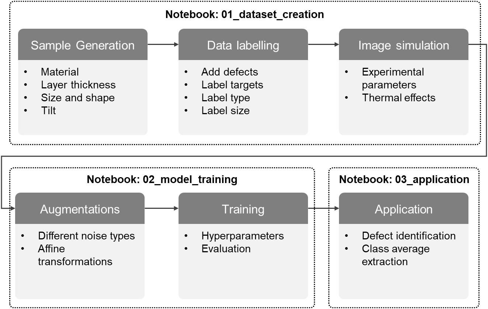

# 2D Defect Detection using Deep Learning

This repository presents an advanced deep learning framework for detecting defects in 2D multi-layer material STEM-HAADF (Scanning Transmission Electron Microscopy - High-Angle Annular Dark-Field) images. Our focus is on 2L CrSBr, where we not only identify defect distributions but also analyze complex structures that emerge.

The project is structured around three comprehensive Jupyter notebooks that guide users through the entire workflow:

1. Creating synthetic training data
2. Training deep learning networks
3. Analyzing experimental STEM-HAADF images

## Workflow Overview

## Repository Structure

|Component|Description|
|:--|:--|
|[`data/`](./data/README.md)| Contains all necessary data to reproduce the results presented in our manuscript. |
|[`helpers/`](./helpers/README.md)| Houses utility functions used across the notebooks. |
|[`01_dataset_generation.ipynb`](./01_dataset_generation.ipynb)| Demonstrates the process of generating a synthetic dataset. |
|[`02_training_model.ipynb`](./02_training_model.ipynb)| Guides through the training of our deep learning model. |
|[`03_application.ipynb`](./03_application.ipynb)| Showcases the application of the trained model to experimental data.|

## Getting Started

To use this repository:

1. Clone the repository to your local machine.
2. Ensure you have all required dependencies installed (list provided in `requirements.txt`).
3. Follow the notebooks in numerical order for a step-by-step walkthrough of the entire process.

## Customization and Contribution

We encourage adaptation of this framework to other projects. Feel free to fork the repository and modify the code to suit your specific needs. If you make improvements or add features, we welcome pull requests!

## Citation

If you find this project helpful in your research, please consider citing our manuscript:
